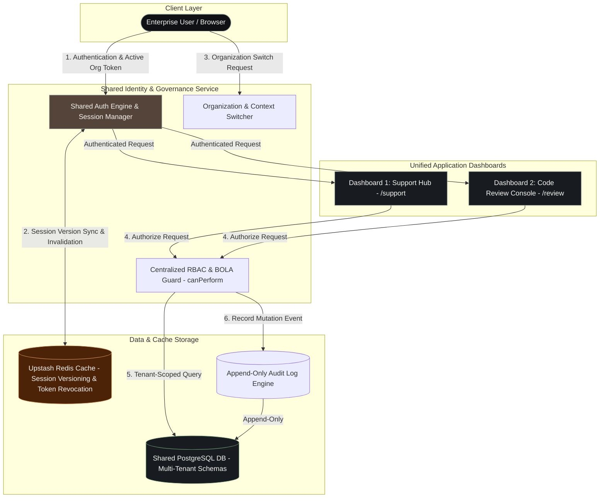
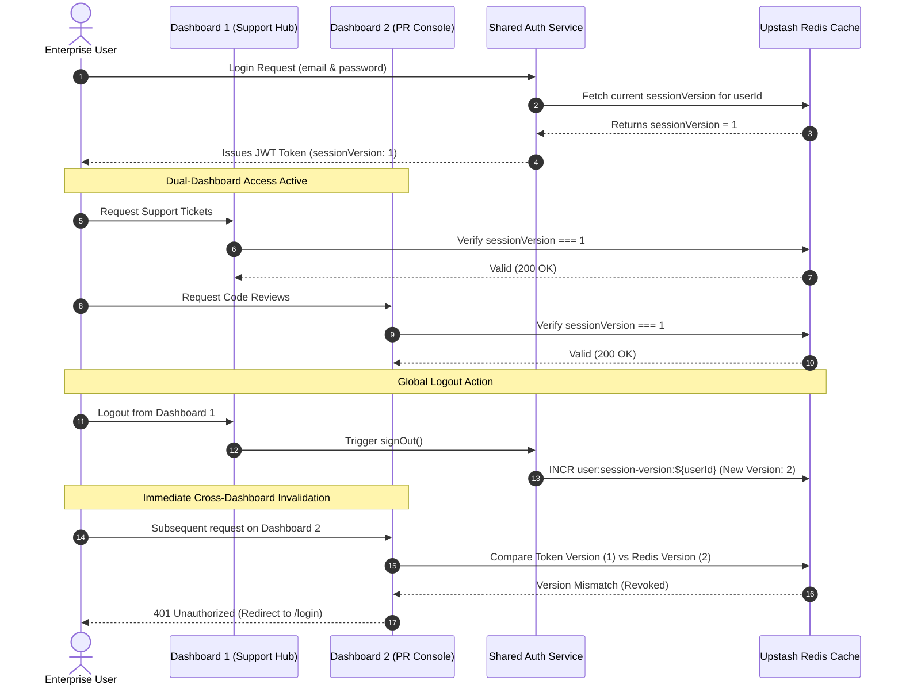
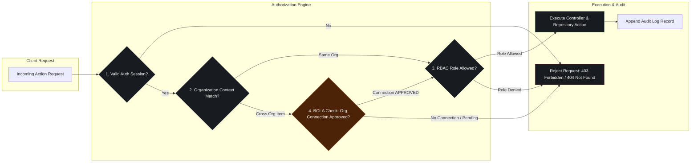

# System Architecture & Diagrams

## 1. High-Level System Architecture Diagram
*(Shared Identity/Org Service, Dashboard 1: Support Hub, Dashboard 2: Code Review Console, PostgreSQL, and Redis Cache)*

---

## 2. Session Synchronization & Global Revocation Diagram
*(Cross-Dashboard Single Sign-On and Multi-Device Session Invalidation)*

---

## 3. Multi-Tenant Authorization & BOLA Prevention Flow
*(Cross-Org Data Isolation, Shared Resources, and Append-Only Audit Trail)*

---

## Data Flow & Control Architecture Explanation

1. **Authentication & Session Synchronization**: Users authenticate via the Shared Identity Service. NextAuth issues a signed JWT containing active organization memberships and `sessionVersion`. Every API request compares the token's version against Redis; logging out increments the Redis counter, instantly invalidating sessions across both **Dashboard 1** and **Dashboard 2**.
2. **RBAC & BOLA Isolation**: All route handlers enforce centralized authorization through `canPerform(user, action, context)`. Queries are automatically scoped by `activeOrgId`. Cross-org items (shared tickets or PRs) require an active `APPROVED` connection in `OrgConnection` to prevent Broken Object Level Authorization (BOLA).
3. **Append-Only Immutable Audit Trail**: System mutations (creating tickets, approving PRs, updating statuses, or sharing resources) trigger an automatic, append-only record in PostgreSQL storing actor details, target resource IDs, action type, and timestamps.
