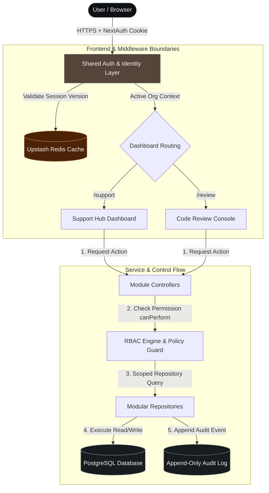
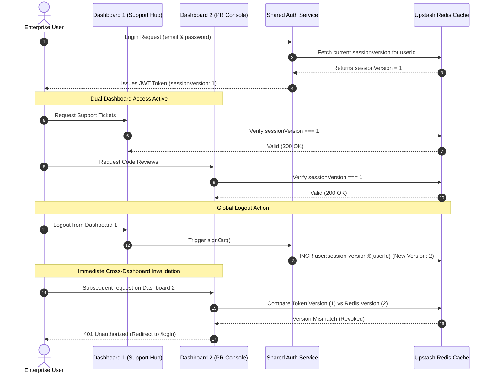
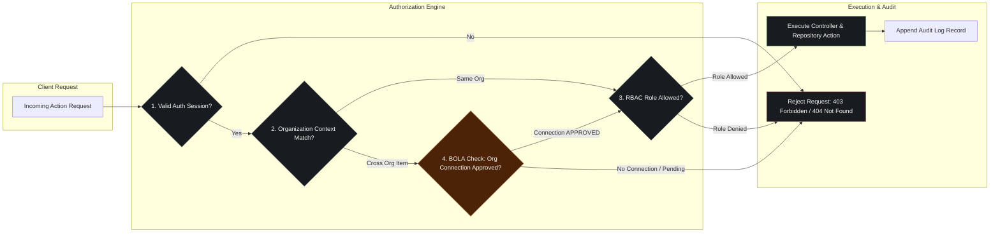

# System Architecture & Diagrams

## 1. High-Level System Architecture Diagram
*(User → Auth/Identity Layer → [Support Hub | Review Console] → Shared Postgres DB with Redis and Audit Log side components)*

---

## 2. Session Synchronization & Global Revocation Diagram
*(Cross-Dashboard Single Sign-On and Multi-Device Session Invalidation)*

---

## 3. Multi-Tenant Authorization & BOLA Prevention Flow
*(Cross-Org Data Isolation, Shared Resources, and Append-Only Audit Trail)*

---

## Data Flow & Control Architecture Explanation

1. **Authentication & Session Validation**: When a user makes a request, NextAuth validates the JWT against the shared identity service and compares the token's `sessionVersion` with Redis to ensure immediate cross-dashboard revocation if logged out.
2. **Role-Based Access Control (`canPerform`)**: Every controller invokes `canPerform(user, action, context)` to evaluate the user's role in their active organization (`ORG_ADMIN`, `SUPPORT_AGENT`, `REVIEWER_APPROVER`, `CROSS_ORG_GUEST`, or `PLATFORM_SUPER_ADMIN`) before executing domain logic.
3. **Tenant-Scoped Repository Queries**: Domain services query PostgreSQL strictly through modular repositories, automatically scoping query filters by `orgId` or explicitly verifying cross-org share permissions (`OrgConnection` status `APPROVED`) to eliminate Broken Object Level Authorization (BOLA).
4. **Append-Only Audit Logging**: All state-mutating actions (ticket creation, PR review decisions, sharing events) automatically emit an immutable audit log record to PostgreSQL with actor, action type, timestamp, and target resource metadata.
